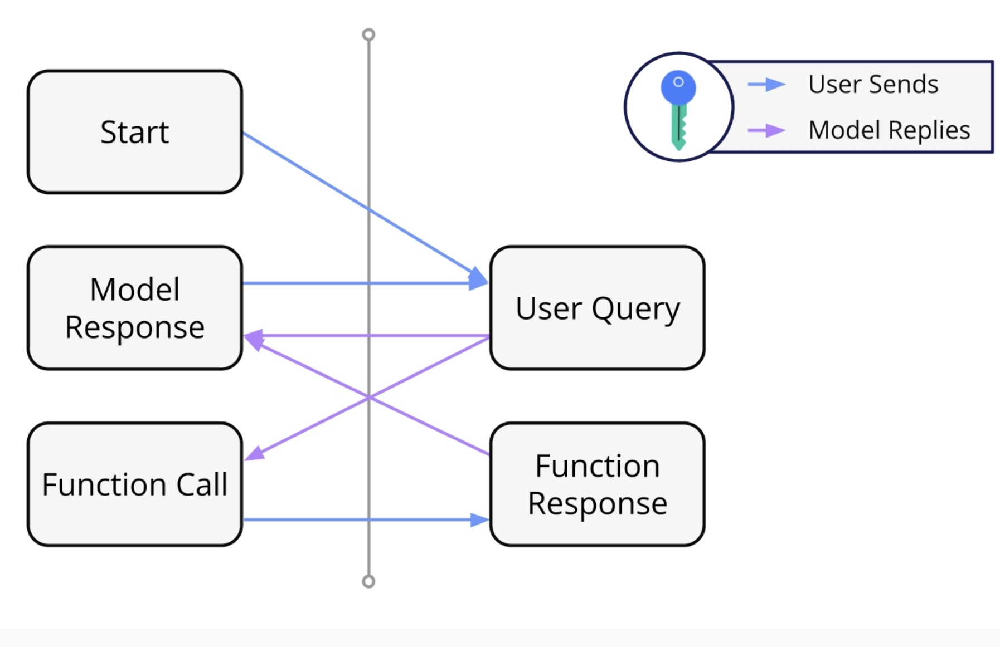
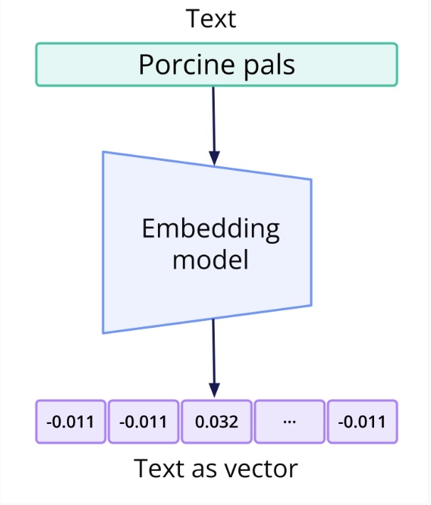

# 3 Developing with Gemini API

0. [Requirements](#schema0)

1. [Introduction](#schema1)
2. [Prompting with the Gemini API](#schema2)
3. [General Parameters](#schema3)
4. [Function Calling](#schema4)
5. [Safety](#schema5)
6. [Embeddings](#schema6)
7. [Appendix: Other Gemini API Features](#schema7)


[DOC](#schemadoc)

<hr>
<a name='schema0'></a>

## 0. Requirements
- Crea un entorno virtual usando venv
```bash
python3 -m venv developing
```
Activar el Entorno Virtual
- Para activar el entorno virtual, ejecuta:
```bash
source developing/bin/activate
```

- Instalar Dependencias Usadas
    - Jupyter Notebook
        ```bash
        pip install jupyter
        ```
    - python-dotenv
        ```bash
        pip install python-dotenv
        ```
- Guardar Dependencias
Para guardar las dependencias en un archivo requirements.txt:
```bash
pip freeze > requirements.txt
```
- Desactivar el Entorno Virtual
```bash
deactivate
```

<hr>
<a name='schema1'></a>


## 1. Introduction

### Application Programming Interfaces (APIs)
Remember, an application programming interface (API) allows computer programs to communicate using a predetermined protocol. We are going to use the Gemini API so our Python code can communicate with the Gemini family of large language models!


### Gemini API Keys
#### Introduction

We interact with APIs using API keys. A key is a unique identifier that is passed along with API requests to authenticate the client making the request. It helps ensure that only authorized users or applications can access the API and its services.

Note that for the Gemini API, there are two ways of creating a key:

#### Personal use
As part of an organization. Note: You need to ask your admin owner to grant you access to the "Early Access Apps" setting!
Between these two methods, the rest of the setup is the same.

**Important:** After generating these keys, keep them secure, you should never post them public or give them out. Treat them like passwords!

#### Creating a Gemini API Key
1. Navigate to the Google AI for Developers [home page](ai.google.dev)
2. Scroll down and click on the button "Get API Key in Google AI Studio"
3. Click "Create API Key" and "Create API key in new project" if you have not made a project before
4. Copy the key

### Google Colaboratory (Colab)
#### Introduction
Google Colaboratory, or Colab for short, is a free Jupyter Notebook service from Google. We will use Colab notebooks for our Python code in the rest of this course.

You can create a new Colab notebook by navigating to https://colab.new/. To follow along with the course content, click the "Open in Colab" buttons.

Google Colab shows a warning when you open a notebook that was not authored by Google. Click "Run anyway" when you see the message about the notebook being loaded from GitHub.

### Adding Your API Key to Google Colab
1. Open a Colab notebook
2. Click on the Secrets tab on the left side menu (represented by a key icon)
3. Click "Add new secret", type GOOGLE_API_KEY in the "Name" field, and paste your key in the "Value" field
4. Toggle the "Notebook access" switch to be "on" (represented by a checkmark)


**Important:** 
Use Jupyter Notebook:

You have the option to download the notebooks from the repository linked above and to use a local Jupyter Notebook environment, but you will need to adjust some of the code. For example, instead of using `from google.colab import userdata and GOOGLE_API_KEY = userdata.get("GOOGLE_API_KEY")`, you might use `import os and GOOGLE_API_KEY = os.environ["GOOGLE_API_KEY"]`. We will only be providing the Colab version of the code in this course.

<hr>
<a name='schema2'></a>


## 2. Prompting with the Gemini API

[Prompts_With_Gemini_API](/Prompts_With_Gemini_API.ipynb)

### Core Functionality of Gemini
Gemini is known as a multimodal LLM, which means it can take in multiple types of data to output text. It can take in the following as input:

Text
Image
Audio
Video


<hr>
<a name='schema3'></a>

## 3.General Parameters

[Gemini_General](/Gemini_General.ipynb)

### Gemini General Parameters
Gemini offers many tools for developers to make the best use out of it. Among them, there are three parameters that can be inspected or tuned:

- Temperature
- Max output length
- Token counting
Note that adjusting these parameters only impacts the behavior of the model as it generates new outputs. This is not the same as model fine-tuning, which re-trains the underlying model.

#### Temperature
The Gemini LLM is non-deterministic, meaning that the same prompt can result in wildly different outputs. But how different can they be? This is controlled by the parameter temperature.


### Max Output Length
Gemini (and all LLMs) generate output in the form of tokens.

### Token Count
Finally is token count. Similar to before, LLMs operate in tokens for both input and output, and are often billed at large scale. It's important to know how many tokens an input might be before giving it to the mode

<hr>
<a name='schema4'></a>


## 4. Function Calling
[Gemini_Function_Calling](/Gemini_Function_Calling.ipynb)

### Function Calling

In essence, Gemini has the ability to call user-defined functions, and this feature is called function calling

### How Does Function Calling Work?
Behind the scenes, here is how function calling works:

- The user submits a query to the model.
- The model responds with a function call.
- The user runs the function and returns the result of the function.

Now, the model will either go back to Step 2 or output a final response, as seen above.



<hr>
<a name='schema5'></a>

## 5.Safety

[Gemini_Safety](/Gemini_Safety.ipynb)

Safety Settings
As a reminder, before this demo begins, always remember to handle AI responsibly and to follow ethical guidelines.

Safety is an important built-in feature of Gemini. Let's learn more about what it can do:

- How to check if your prompt was blocked by the safety filter
- Which safety filters caused the block
- How to adjust settings to unblock it

<hr>
<a name='schema6'></a>

## 6. Embeddings
[Gemini_API_Embeddings](/Gemini_API_Embeddings.ipynb)

### Embeddings
Before jumping into what Gemini can do in regards to embeddings, let's review: what are embeddings?

Embedding Definition: Embeddings are vectors (represented as lists of decimal point numbers) that represent words, documents, images, and even videos. They're a list of numbers so that machine learning models can easily process them. They can be used in a wide variety of tasks like document search, anomaly detection, and text classification.


<hr>
<a name='schema7'></a>

## 7. Appendix: Other Gemini API Features

### Introduction
The Gemini API offers several other features that have not been covered in this module. Some of these features are experimental and may not work in a Google Colab environment. Check the Gemini API Cookbook link below for the latest tutorials.

### Features
#### OAuth
OAuth is a more advanced authentication technique than using an API key. It can provide better access control and can utilize Google Cloud service accounts.

#### Streaming
Streaming means that the model returns chunks of content as they are generated, instead of waiting until the whole generation process is complete before returning a response. This allows multiple asynchronous functions to run simultaneously instead of blocking each other.

Note: Google Colab does not currently support this functionality.

#### Tuning (Fine-Tuning)
If structured prompting is not enough to get the desired behavior from a model, fine-tuning can be used to modify the actual model weights. Tuned models can be evaluated and saved for future use.

Note: OAuth is required for performing fine-tuning.

#### Context Caching
In some cases, the same input tokens might be passed repeatedly the same model. At high enough volumes, context caching can save money when the same tokens are used multiple times.

Note: Context caching is only available for some models.

#### Code Execution
LLMs often struggle to complete tasks related to numbers, such as listing exactly 5 responses. Code execution allows you to use Python code as a tool to help the LLM with this type of task. This feature is similar to function calling, but less flexible, because it always uses a fixed, isolated Python environment rather than a configurable environment.


<hr>
<a name='schemadoc'></a>

[DOC](#schemadoc)


- [Excercise and Demo, Udacity](https://github.com/udacity/gemini-api-course)
- [Function Calling](https://ai.google.dev/gemini-api/docs/function-calling?utm_source=udacity&utm_medium=referral&utm_campaign=gemini-api-course&utm_content=embedding&hl=es-419)
- [Safety setting](https://ai.google.dev/gemini-api/docs/safety-settings?utm_source=udacity&utm_medium=referral&utm_campaign=gemini-api-course&utm_content=embedding&hl=es-419#safety-feedback)
- [Safety guidance](https://ai.google.dev/gemini-api/docs/safety-guidance?utm_source=udacity&utm_medium=referral&utm_campaign=gemini-api-course&utm_content=embedding&hl=es-419)
- [Embeddings](https://ai.google.dev/gemini-api/docs/embeddings?utm_source=udacity&utm_medium=referral&utm_campaign=gemini-api-course&utm_content=embedding&hl=es-419)